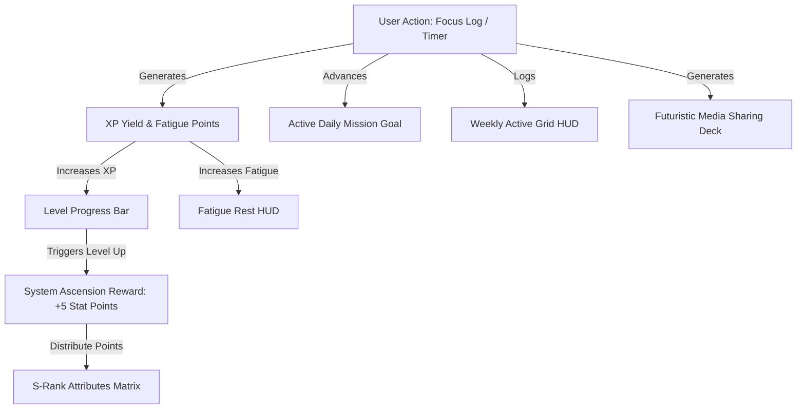

# 🛰️ Ascend: Gamified Cyberpunk Productivity HUD
Welcome to **Ascend**, a high-fidelity, cyberpunk-inspired productivity and focus-tracking application. Ascend transforms everyday work, study, and reading into a deep, manhwa-style role-playing game (RPG) progression system. Gain XP, distribute attribute points, unlock abilities, and export beautiful story-card graphics to share your progress.

Below is the complete product feature checklist, UI designs, and system architectures currently implemented in the **Ascend Mobile App**.

---

## 💎 Core Feature Matrix



---

## 1. ⚡ Solo Leveling Level Bar & Cybernetic Status Card
The entry point to your S-Rank progression, featured prominently at the top of the **Home Dashboard**.

### 🎨 UI Design & Visuals
* **Breathing Neon Border:** Outer glowing cyan border with dynamic pointer markings (`» »`) and slash indicators (`// // //`).
* **Breathing Background Glow:** A pulsing `Reanimated` background opacity cycle that brings the card to life.
* **Badges HUD:** Neon LVL badge showing computed level, current active Epic Title, and Job Class in high-contrast cyan.
* **XP Live Progress Bar:** A glowing neon progress bar that fills dynamically with `withTiming` animation.
* **Stat Points Alert:** Glowing amber badge warning `+N STAT PTS` if the user has unallocated attribute points.
* **Ascension Indicator:** Active live percentage tracking (e.g. `83% ASCENSION`) with cybernetic markings `« TAP TO DISTRIBUTE STATS »`.

### ⚙️ Under the Hood Mechanics
* **Computed Leveling (`utils/levels.ts`):** Calculates levels dynamically using a curve scale:
  $$\text{Level} = \lfloor \sqrt{\text{XP}} \rfloor$$
  $$\text{Progress} = \text{XP} - \text{Level}^2$$
  $$\text{Next Target} = (\text{Level} + 1)^2 - \text{Level}^2$$
* **Ascension Trigger Loop:** Tapping the bar triggers the **System Status Modal**.
* **Auto Level-Up Hook:** Tracks computed levels inside `SoloLevelingBar.tsx`. If `computedLevel > lastLevel`, it immediately triggers a **SYSTEM ASCENSION** notification, awards `(level - lastLevel) * 5` attribute points, updates `lastLevel`, and prompts the user to distribute points.

---

## 2. 👑 Immersive System HUD Modal
An overlay window designed to look like a futuristic S-Rank Status screen, fully scrollable and responsive across all device sizes.

### 🎨 UI Design & Visuals
* **Cyber Overlay Backdrop:** Midnight black semi-transparent backdrop (`bg-black/85`) with a glowing neon-cyan border dropshadow (`shadow-[#00F0FF]`).
* **Header Banner:** Sharp header marked `» STATUS WINDOW «` and `ACCESS KEY ACTIVE` in primary cyan-neon, with a red circular close toggle (`✕`).
* **Compact Layout:** Compressed margins and padding ensuring full visibility and zero clipping on small screens.

### 🎮 Gamified Sub-Modules
* **Hunter Identification Card:**
  * Displays user's username, level, HP, and MP stats (derived dynamically from level scale).
  * **Inline Editors:** Tapping the ✏️ pencil icon next to **Job Class** (e.g. *Shadow Monarch*) or **Active Title** (e.g. *One Who Surmounted Adversity*) enables inline text input with local state binding and store persistence.
  * **Fatigue HUD:** Accumulates fatigue during work. Contains a live crimson energy bar, a percentage tracker (`fatigue / 100`), and a glowing **`[REST]`** button that clears fatigue to `0` with a cybernetic notification.
* **Attribute Matrix:**
  * Lists attributes: **💪 Strength, ⚡ Agility, ❤️ Vitality, 🧠 Intelligence, and 👁️ Sense**.
  * Displays available stat points. Distributing points using `[+]` updates values instantly and saves them to local storage.
  * **Manual Calibration Override:** Toggle to activate developer override mode, permitting direct typing/inputs of all five stats and available point counts.
* **Active & Passive Ability Matrix:**
  * Displays unlocked **Active Skills** and **Passive Traits** (e.g. *Focus Burst*, *Shadow Coding*, *Unyielding Will*) with native badge wrappers.
  * Upgrade button `[+]` increments individual ability levels, and `[✕]` deletes the skill entirely.
  * **Wake Up Ability Form:** Add custom-named abilities and designate them as either Active or Passive.

---

## 3. 🔄 Swipeable Quick-Action Dashboard Carousel
Replaces the classic static grid with a smooth, paging horizontal carousel to maximize dashboard space and interactions.

### 🎨 UI Design & Visuals
* **Horizontal Swipe Viewport:** Uses React Native's `ScrollView` configured with `pagingEnabled` and `snapToInterval` to snap cleanly to cards.
* **Snappy Pagination Ticks:** Interactive indicator dots at the bottom of the carousel that light up in your active accent theme to reflect the active index.
* **Compact Paging Cards:** Renders three high-fidelity cards:

```
[ Card 1: Daily Streak ] ──► [ Card 2: Mission goals ] ──► [ Card 3: Weekly Grid ]
   - Fire flame emoji           - Active mission tracking     - 7-day grid HUD
   - Log session button         - Goal progress bar           - Lights up focus days
```

### 📋 Card Breakdown
1. **Streak & Action Card:** Tracks your daily focus streak, sessions completed today, and total focus hours. Features a quick-action **`+ Record`** button to log sessions.
2. **Goal Suggestion Card:** Automatically recommends active daily focus goals. Contains a **Shuffle `[🔄]`** button to cycle through presets (Coding, Study, Reading targets) and a **`Set Goal`** button. If active, shows a custom progress bar tracking elapsed minutes vs target minutes.
3. **Weekly Snapshot HUD:** Shows a 7-day matrix grid (Mon - Sun). Days where focus sessions were completed light up in active neon, giving an instant visual summary of weekly performance.

---

## 4. ⏱️ Session Focus Timer & Manual Logger
The action engine that records focus times and feeds XP and fatigue points into the gamification stores.

### 🎨 UI Design & Visuals
* **Live Focus Timer (`SessionCard.tsx`):** Renders a large cybernetic timer showing elapsed focus time with category tags, custom notes, play/pause toggles, and dynamic circular indicators.
* **XP Yield Alerts:** Shows exactly how much XP you will earn upon completing the session.
* **Manual Log Modal (`ManualLogModal.tsx`):** A custom modal enabling manual logs by selecting a category (Study, Coding, Reading), inputting duration in minutes, and writing a short accomplishment note.

### ⚙️ Under the Hood Mechanics
* **Dynamic Fatigue Generation:** Focus sessions introduce physical fatigue on the S-Rank character. Saving a live session or logging a manual session automatically increments fatigue by:
  $$\text{Fatigue Gained} = \max\left(5, \left\lfloor \frac{\text{Duration in Mins}}{3} \right\rfloor\right)$$
  *(Working for 1 hour increases fatigue by +20 points, up to a maximum limit of 100)*.
* **XP Calculations:** Focus categories yield XP scaled by duration:
  * **Coding:** 1 XP per minute.
  * **Study:** 1 XP per minute.
  * **Reading:** 0.8 XP per minute.

---

## 5. 📸 Sharing Media Deck & Visual Story Templates
Generate stunning, high-impact graphic cards to share focus metrics on Instagram Stories, WhatsApp Status, and other social media feeds.

### 🎨 UI Design & Visuals
* **Dynamic SVG Render (`SessionCardSVG.tsx`):** A beautifully composed vector template layout that packages username, focus category, duration, XP earned, current Level, streak, focus note, date, and cyberpunk asset decals into a gorgeous 1080x1920 card.
* **Aesthetic Templates:**
  1. 🛰️ **Cyber HUD:** Cyan-neon cyberpunk vector grids.
  2. 🌌 **Aurora Flow:** Deep cosmic purple glowing orbs.
  3. 🌅 **Retro Grid:** Synthwave 80s arcade sunset grids.
  4. 🕶️ **Stealth Carbon:** Matte carbon backdrops with metallic gold typography.
  5. 🏃‍♂️ **Strava Sport:** High-impact athletic orange decals.
* **Smartphone Viewport Simulator:** A gorgeous vector phone border that overlays Instagram Story or WhatsApp Status safe-zones, allowing you to preview how the graphics fit before sharing.

### ⚙️ Under the Hood Mechanics
* **High-Res Export (`export.ts`):** Uses off-screen rendering with `captureRef` to capture the vector card at full `1080x1920` resolution and copy it to device storage using `expo-file-system/legacy` and `expo-sharing`.

---

## 6. ⚙️ Profile Settings & Accent Customization
Manage user aesthetics and robust database configurations.

### 🎨 UI Design & Visuals
* **Emblem Pickers:** Select futuristic avatars (**Astronaut 👨‍🚀, Rocket 🚀, Cypher 👾, Phoenix 🔥**).
* **Futuristic Theme Accents:** Instantly switch between **Blue (#7BE7FF), Purple (#B77BFF), and Teal (#0DF5C4)**. Colors instantly apply to all glowing borders, bars, and indicators app-wide.
* **Data Deck Center:**
  * **Export Backup:** Saves all local history, logs, S-Rank stats, and credentials into an `ascend-backup.json` and opens native sharing sheets.
  * **Import Backup:** Restores backups from `.json` files.
  * **Wipe Local Database:** Fully purges all stores and instantly restarts the onboarding experience.

---

## 💾 Core Stores & Data Persistence
All data is stored locally on the device using robust, persisted Zustand stores linked to asynchronous device storage:

1. **`useSoloLevelingStore` (`mobile/store/soloLeveling.ts`):** Manages character attributes, active title, job class, custom skills, fatigue levels, and level milestones.
2. **`useEventsStore` (`mobile/store/events.ts`):** Manages completed and manual focus logs.
3. **`useProfileStore` (`mobile/store/profile.ts`):** Manages user credentials, emblem avatars, and active color theme accent.
4. **`useGoalsStore` (`mobile/store/goals.ts`):** Manages suggested daily goal presets and active goal increments.
